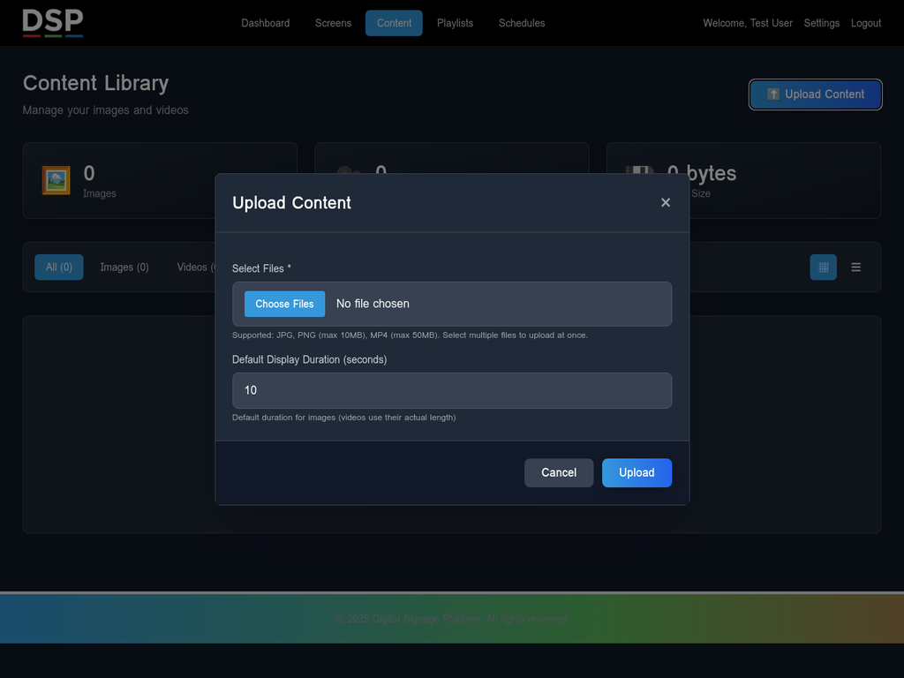
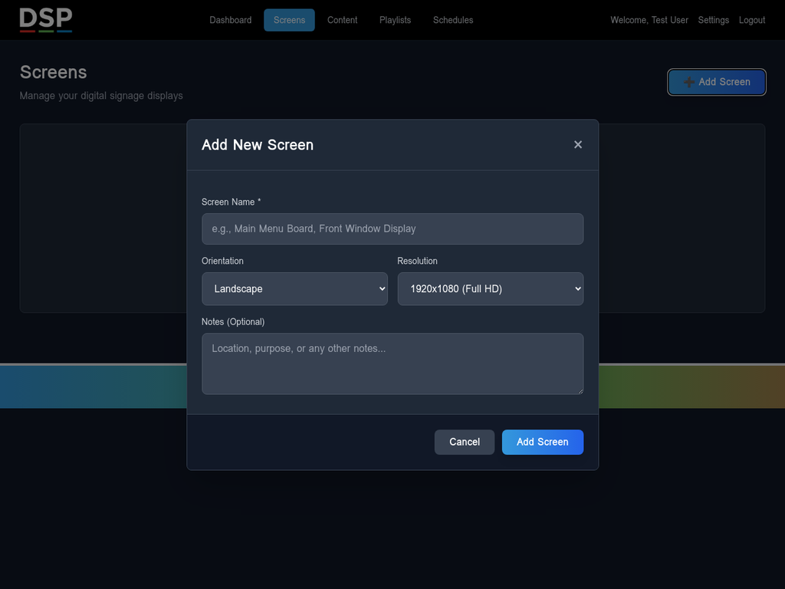
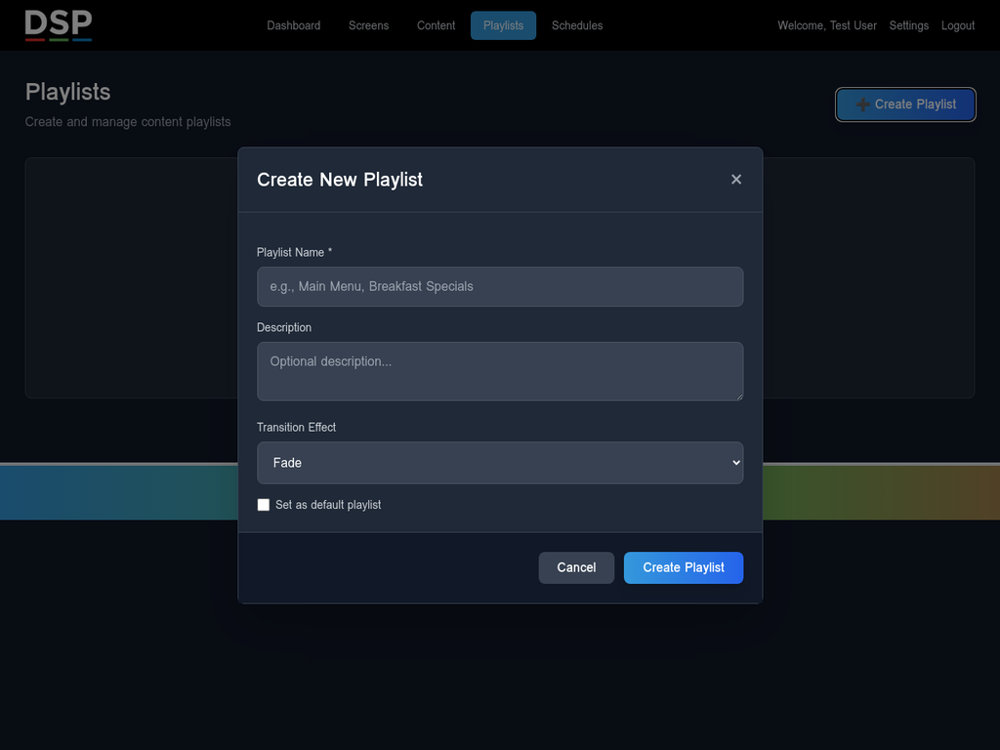
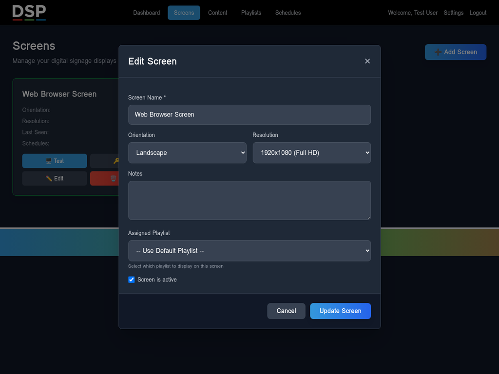

'''
# Getting Started Guide: Web Browser Digital Signage

Welcome to the Digital Signage Platform! This guide will walk you through the entire process of setting up and displaying your digital signage content directly in a web browser. By the end of this guide, you will have your content playing on a public URL that you can use on any device with a web browser.

Let's get started!

---

## Step 1: Upload Your Content

The first step is to upload the images and videos you want to display. All your media files are managed in the **Content Library**.

1.  **Navigate to the Content Page:** From the main menu, click on **"Content"**.
2.  **Open the Upload Modal:** Click the **"⬆️ Upload Content"** button in the top-right corner.
3.  **Select Your Files:** In the modal, click the "Select Files" button and choose the images (JPG, PNG) and videos (MP4) you want to upload. You can select multiple files at once.
4.  **Set Default Duration:** For images, you can set a default display duration in seconds. Videos will use their actual length.
5.  **Upload:** Click the **"Upload"** button. Your files will be uploaded and processed. You will see them appear in your Content Library.

---
'''

## Step 2: Create a Screen

A "Screen" is a virtual display that you will assign content to. You can create as many screens as you need. For this guide, we will create one screen that will be displayed in a web browser.

1.  **Navigate to the Screens Page:** From the main menu, click on **"Screens"**.
2.  **Open the Add Screen Modal:** Click the **"➕ Add Screen"** button.
3.  **Name Your Screen:** Give your screen a descriptive name, such as "Lobby Display" or "Web Browser Screen".
4.  **Add Screen:** Click the **"Add Screen"** button. Your new screen will appear in the list.

---

## Step 3: Create a Playlist

A Playlist is a collection of content items that you can arrange in a specific order. You can then assign a playlist to one or more screens.

1.  **Navigate to the Playlists Page:** From the main menu, click on **"Playlists"**.
2.  **Open the Create Playlist Modal:** Click the **"📋 Create Playlist"** button.
3.  **Name Your Playlist:** Give your playlist a name, like "Morning Announcements" or "Product Showcase".
4.  **Add Content:** In the modal, you will see your content library on the left. Drag and drop the content items you want to include into the playlist area on the right.
5.  **Arrange Content:** You can reorder the items in the playlist by dragging and dropping them into the desired sequence.
6.  **Save Playlist:** Click the **"Save Playlist"** button.

---

## Step 4: Assign a Playlist to a Screen

Once you have a playlist, you need to assign it to a screen to be displayed.

1.  **Navigate to the Screens Page:** Go back to the **"Screens"** page.
2.  **Select Your Screen:** Find the screen you created earlier and click the **"Assign Playlist"** button.
3.  **Choose a Playlist:** In the modal, select the playlist you want to display on this screen from the dropdown menu.
4.  **Save Assignment:** Click the **"Save"** button.

Your screen is now set up to display the content in your playlist.

---

## Step 5: View Your Screen in a Web Browser

Now that your screen is set up and has a playlist assigned, you can view it in any web browser. Each screen has a unique, public URL that you can open on any device.

1.  **Navigate to the Screens Page:** Go to the **"Screens"** page.
2.  **Get the Screen Key:** Find your screen and click the **"🔑 Key"** button. This will reveal the unique device key for your screen.
3.  **Copy the Viewer URL:** Copy the provided viewer URL. It will look something like this: `https://dsp.my-toolbox.info/viewer.php?key=YOUR_DEVICE_KEY`
4.  **Open in a New Tab:** Open a new browser tab and paste the URL. Your playlist will begin playing in the browser.

---

Congratulations! You have successfully set up your first digital sign using the web browser version. You can now use this URL on any smart TV, computer, or tablet to display your content.
